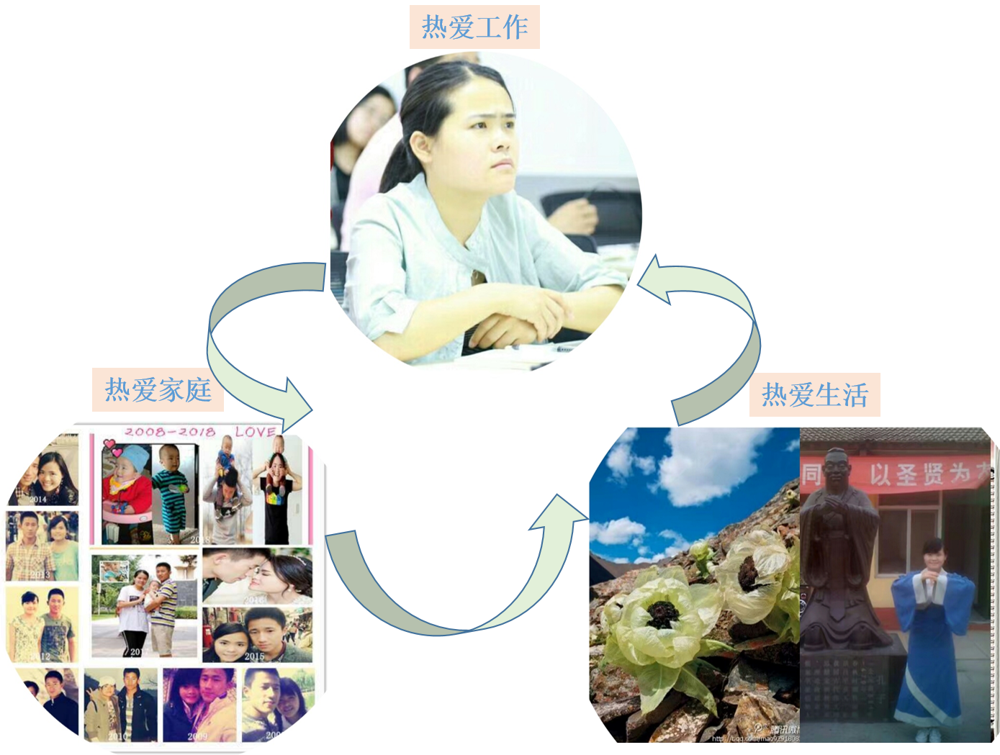

 

<!-- 

-->
<!--

热爱工作.

热爱家庭.

热爱生活.

-->

<h2>主要研究内容</h2>

<ul type="square">
	<li>E3SM地球系统模式中全球水文循环模拟与分析；</li>
	<li>卫星遥感陆表蒸散发；</li>
	<li>分布式水文模型开发与应用； </li>
	<li> RS/GIS 在水文或者电力方面的应用；</li>
</ul>

<h2>教育经历</h2>

<ul type="square">
	<li>2017.11-至今      访问博士后  美国西北太平洋国家实验室</li>
	<li>2014.9-2017.7      博士      北京师范大学 全球变化与地球系统科学研究院</li>
	<li>2011.9-2014.7      硕士      北京师范大学 全球变化与地球系统科学研究院 </li>
	<li>2007.9-2011.7      本科       聊城大学 环境与规划学院 地理信息系统专业</li>
</ul>

<h2>主要奖学金&奖项</h2>

<ul type="square">
	<li>2017年:  “博士后国际交流计划”派出项目(全国120人入选)</li>
	<li>2016 年：北京师范大学  研究生一等奖学金</li>
	<li>2013 年：北京师范大学  研究生国家奖学金</li>
	<li>2012 年：北京师范大学  研究生国家奖学金 华藏奖学金</li>
	<li>2011 年：聊城大学      优秀毕业生</li>
	<li>2009 年：国家励志奖学金，英才奖学金，一等奖学金</li>
	<li>2008 年：国家励志奖学金，校三好学生，优秀团员，一等奖学金 </li>
</ul>

<h2>专业技能</h2>
<ul type="square">
	
<li>地球系统模式：Energy Exascale Earth System Model（E3SM）</li>
<li>水文模型：DTVGM，SWAT, VIC</li>
<li>计算机语言：C语言，Matlab，Linux shell，Fortran，Html，Python</li>
<li>GIS专业软件：Arcgis，ENVI，Mapinfo，MapGis，Supermap</li>
<li>其它：Endnote，Photoshop，SPSS，Origin</li>
</ul>

<h2>英语水平</h2>

<ul type="square">
	<li>全国公共英语等级考试5级(PETS5)  (2014)；</li>
	<li>全国大学生英语竞赛（C类）二等奖 (2009)；</li>
	<li>大学生英语六级 (CET-6):   546 (2009)；</li>
	<li>大学生英语四级 (CET-4):   557 (2008)；</li>
</ul>

<!-- 
<h2>Projects</h2>
-->
<!-- 
<ul>
	<li><a href="https://github.com/">Lorem Lorem</a></li>
	<li><a href="https://github.com/">Ipsum Dolor</a></li>
	<li><a href="https://github.com/">Dolor Lorem</a></li>
</ul>
-->
